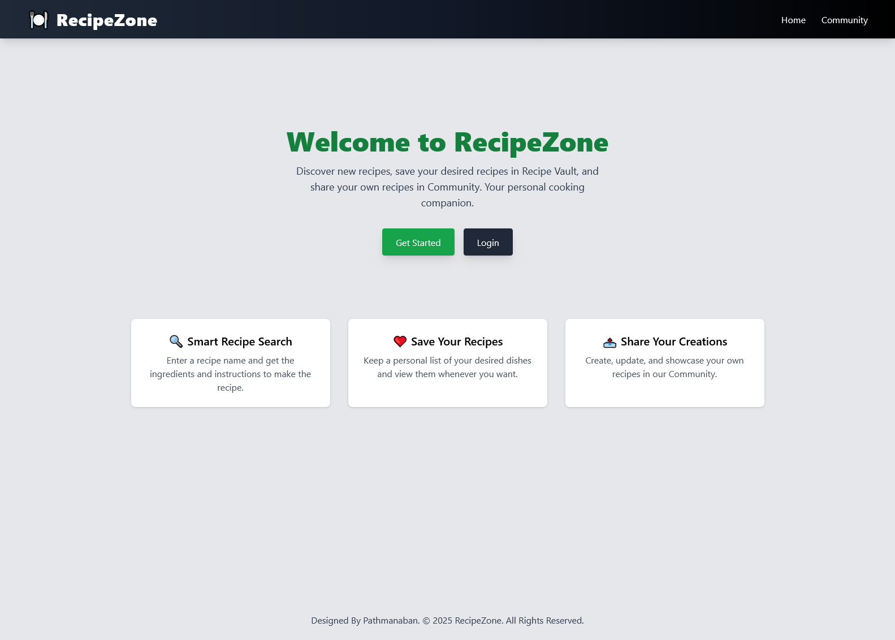
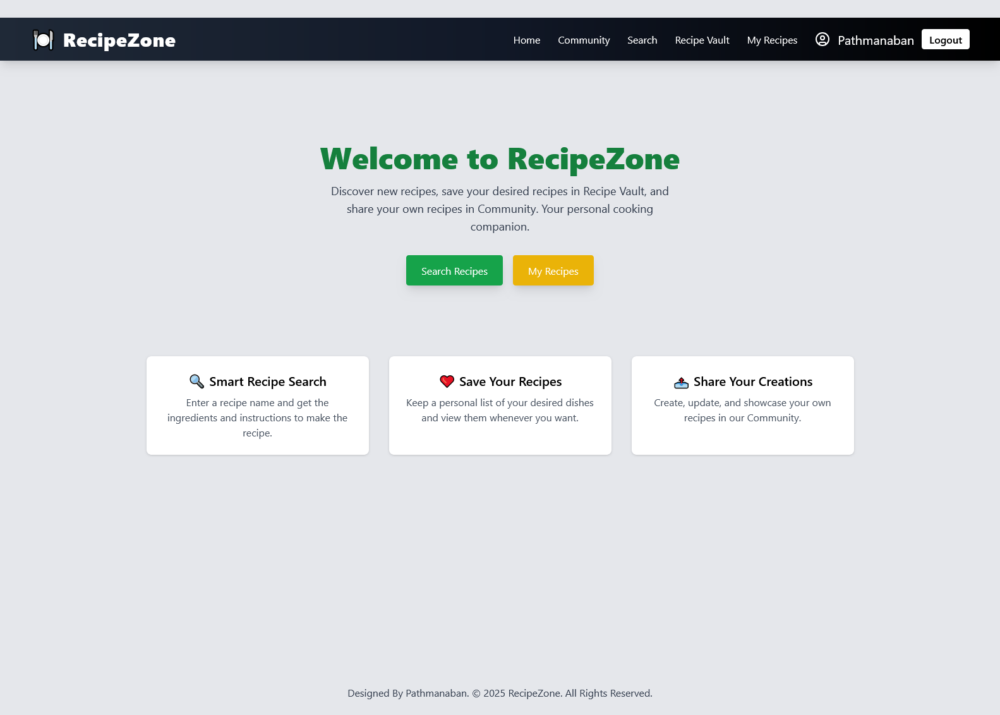
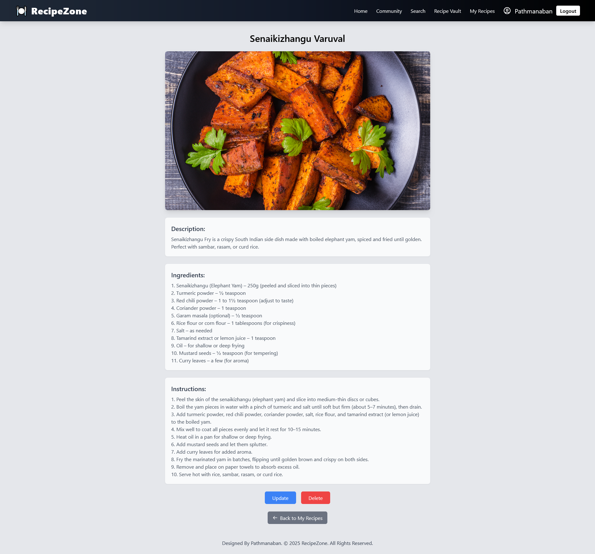

# RecipeZone 🍽️

**RecipeZone** is a modern recipe management platform built with **ReactJS** for the frontend, **ASP.NET Core Web API** for the backend and **MS SQL Server** as the database. It allows users to search recipes, save them to a personal vault, upload their own recipes, and share them with the community.

---

## 🌟 Key Features

### 🔐 User Authentication
- User **registration and login**
- **OTP verification** during signup
- JWT-based session management

### 🔎 Search Recipes
- Search for recipes by name
- View **ingredients** and **step-by-step instructions**

### 📥 Save Recipes
- Save searched recipes to your personal **Recipe Vault** for later use

### ✍️ Upload Your Own Recipes
- Add custom recipes with ingredients and instructions
- Manage recipes under **"My Recipes"** section

### 🌐 Community Sharing
- Choose to make uploaded recipes **public (community)** or **private**

---

## 🛠️ Tech Stack

### Frontend
- ReactJS
- React Router
- Axios
- Tailwind CSS

### Backend
- ASP.NET Core Web API
- Entity Framework Core
- SQL Server
- JWT Authentication
- Email OTP Verification

### 🔧 Tools & Integrations
- 🐳 Docker & Docker Compose – for local development and testing
- ☁️ Cloudinary – for uploading and storing images
- 🤖 OpenRouter API – for AI-powered Recipe Search
- 📬 NotificationAPI – for sending OTPs via email

---

## Getting Started

### Prerequisites

- .NET Core SDK
- Node.js
- npm/yarn
- SQL Server

### Backend Setup

1. Clone the repository:
    ```bash
    git clone https://github.com/pathmanaban666/recipezone-react-dotnetcore.git
    ```

2. Navigate to the backend directory:
    ```bash
    cd recipezone-react-dotnetcore/Backend/RecipeWebApp
    ```

3. Restore NuGet packages:
    ```bash
    dotnet restore
    ```

4. Update appsettings.json:
Before running the backend, update appsettings.json with the required credentials.
    ##### Required Credentials:
    | Credential Type     | Where to Get It                                                                              |
    | ------------------- | ---------------------------------------------------------------------------------------------|
    | **Cloudinary**      | [cloudinary.com](https://cloudinary.com) ->  Obtain the Api Key and Api Secret               |
    | **OpenRouter API**  | [openrouter.ai](https://openrouter.ai) -> Obtain the ApiKey key for the AI model             |
    | **NotificationAPI** | [notificationapi.com](https://notificationapi.com) -> Obtain the ClientId and Client Secret  |
    | **Database**        | SQL Server / LocalDB connection string                                                       |
    | **JWT Credentials** | Define a strong secret key and issuer                                                        |

5. Initialize the database:
    ```bash
    dotnet ef migrations add InitialCreate
    dotnet ef database update
    ```

6. Start the backend server:
    ```bash
    dotnet run
    ```

### Frontend Setup

1. Navigate to the frontend directory:
    ```bash
    cd recipezone-react-dotnetcore/Frontend
    ```

2. Install the required dependencies:
    ```bash
    npm install
    ```

3. Create a `.env` file inside the **Frontend** folder and add the following environment variable if you are running the backend locally with `dotnet run`:
    ```bash
    REACT_APP_BACKEND_URL=http://localhost:5118
    ```

   If you are running the application using **Docker Compose**, update the `.env` file as follows:
    ```bash
    REACT_APP_BACKEND_URL=http://localhost:8080
    ```

4. Run the frontend development server:
    ```bash
    npm start
    ```

   Now, your backend should be running at `http://localhost:5118` and frontend at `http://localhost:3000`.

---

## Screenshots

### Public Home Page




### Register Page


### Otp Page


### Login Page


### User Home Page




### Search Recipe Page


### Recipe Vault Page


### Recipe Vault Recipe View Page


### My Recipes Page


### My Recipe View Page




### My Recipe Create Page


### My Recipe Update Page


### Community Recipes Page


### Community Recipe View Page


### 404 Page


